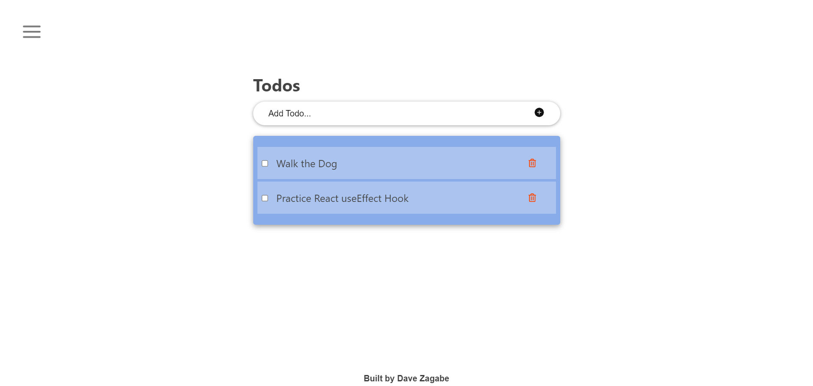

# Todo React

> This project is a complete todo-list built using React and other third-party libraries which allow creation, update an deletion of tasks by a user. The todo list is stored in browser's localStorage.

## Built With

- React.js.
- CSS.
- Node.js (npm).

## Live Demo (if available)

[**See Project 🚀**](https://davezag.github.io/todo-react/)

## Screenshot



## Getting Started

To get a local copy up and running follow these simple example steps.

### Prerequisites

To understand the project you must have some knowledge of HTML, CSS and Javascript(React.js).

### Setup

To run this project one must have Visual Studio (VS) Code installed and running.

### Usage

Clone and access the repository using the following commands on Git Bash:

```
 cd PATH
 git clone https://github.com/DaveZag/todo-react.git
 cd todo-react
 npm install
 code .
 npm start
```

Then using the live server of VS Code you can view the page.

## 👤Author

**Dave Zagabe**

- GitHub: [@Dave Zag](https://github.com/DaveZag)
- Twitter: [@Dave Zagabe](https://twitter.com/davezagabe2)
- LinkedIn: [@Dave Zagabe](https://www.linkedin.com/in/dave-zagabe)

## 🤝 Contributing

Contributions, issues, and feature requests are welcome!

Feel free to check the [issues page](../../issues/).

## Show your support

Give a ⭐️ if you like this project!

## Acknowledgments

- IBAS MAJID for the great React course.

## 📝 License

This project is [MIT](./LICENSE) licensed.
